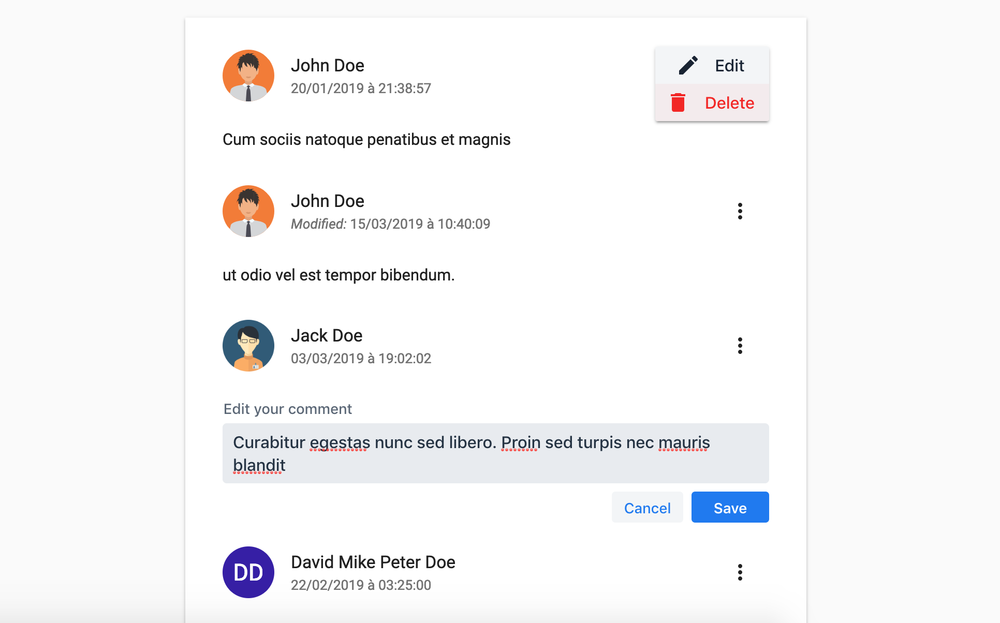

# \<hostabee-comment-flow\>

[](https://travis-ci.org/Hostabee/hostabee-comment-flow) [](https://greenkeeper.io/)
[](https://app.saucelabs.com/u/mlouchart)
[](http://commitizen.github.io/cz-cli/)

Commenting solution out-of-the-box in a web component.

```html
<hostabee-comment-flow></hostabee-comment-flow>
<script>
  const flow = document.querySelector('hostabee-comment-flow');
  // Populate the comment flow
  fetch('https://YOUR_API/comments')
    .then(res => res.json())
    .then(json => flow.comments = json.result);
</script>
```



## Installation

Install `<hostabee-comment-flow>`:

```shell
bower install Hostabee/hostabee-comment-flow --save
```

Once installed, import it in your application:

```html
<link rel="import" href="bower_components/hostabee-comment-flow/hostabee-comment-flow.html">
```

## Running demos and tests in a browser

1. Fork the `hostabee-comment-flow` repository and clone it locally.

2. Make sure you have [npm](https://www.npmjs.com/) and [Bower](https://bower.io) installed.

3. When in the `hostabee-comment-flow` directory, run `npm install` and then `bower install` to install dependencies.

    * [OPTIONAL] If you want to run tests or demo of the element involving the `hostabee-comment-flow-firebase-connector` you have to provide the configuration of your application in the _"test/firebase-config.js"_ and _"demo/firebase-config.js"_ files.

4. Run `npm start`, browser will automatically open the component API documentation.

5. You can also open demo or in-browser tests by adding **demo** or **test** to the URL, for example:

- http://127.0.0.1:3000/components/hostabee-comment-flow/demo/hostabee-comment-flow/basic.html
- http://127.0.0.1:3000/components/hostabee-comment-flow/test

## Running Tests

- When in the `hostabee-comment-flow` directory, run `polymer test`

## Contributing

1. Fork it!
2. Create your feature branch: `git checkout -b my-new-feature`
3. Commit your changes: `git cz` **OR** [follow this commit guide](https://conventionalcommits.org/) to write the commit messages.

4. Push to the branch: `git push origin my-new-feature`
5. Submit a pull request.

## License

Apache License 2.0

## Big Thanks

Cross-browser Testing Platform and Open Source ❤️Provided by:
<!-- Yes, I know. HTML inside mardown file... The only way to change the SVG size without open Inkscape. It could be your first good contribution to fix it! -->
[](https://saucelabs.com)

## Browsers compatibility matrix

[](https://saucelabs.com/u/mlouchart)
